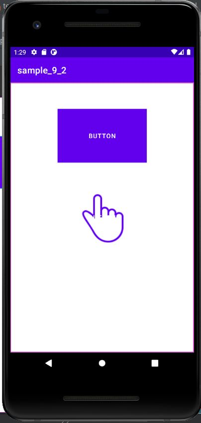

# 캡스톤디자인 주간 A반

##  1주차

## 2주차
  - 출석과제

</img>
</img>

## 3주차

</img>

</img>
## 4주차
## 5주차
## 6주차
## 7주차
## 8주차
## 9주차

</img>
</img>
</img>
## 10주차
## 11주차

## 12주차

## 13주차
## 14주차
## 추가 됨

### 소제목~~
